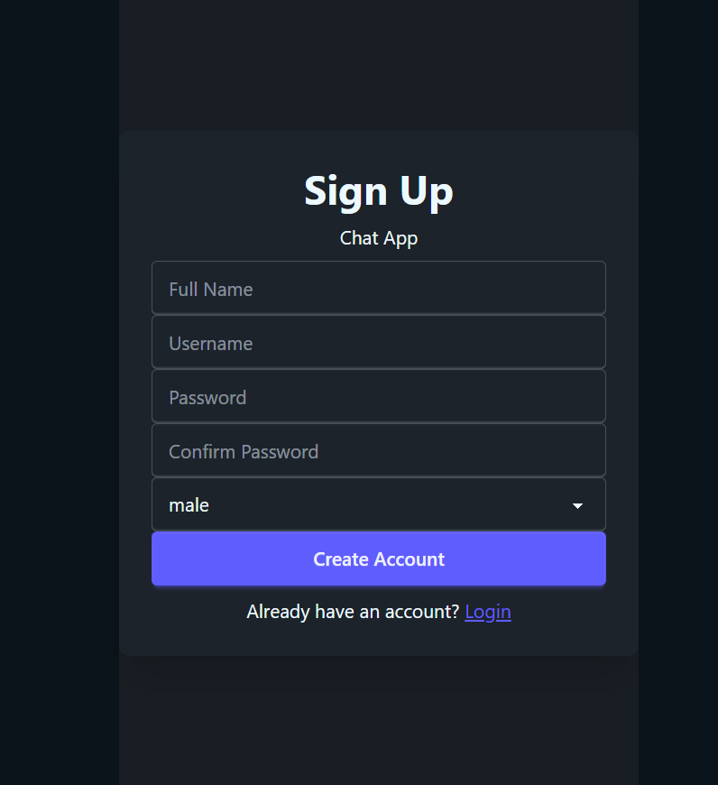
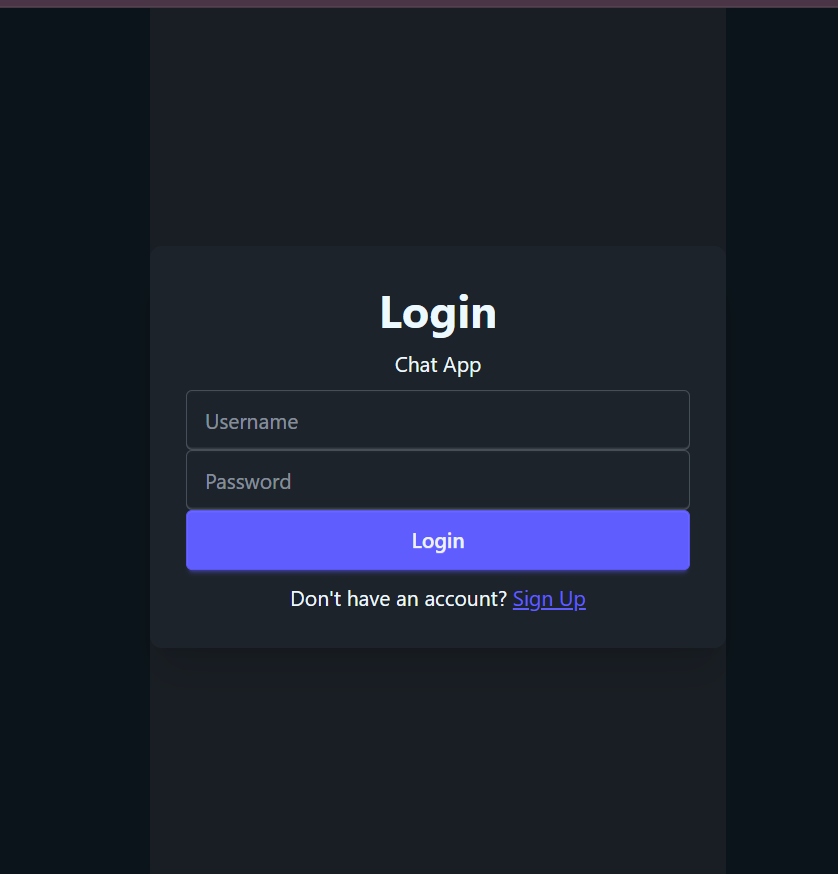
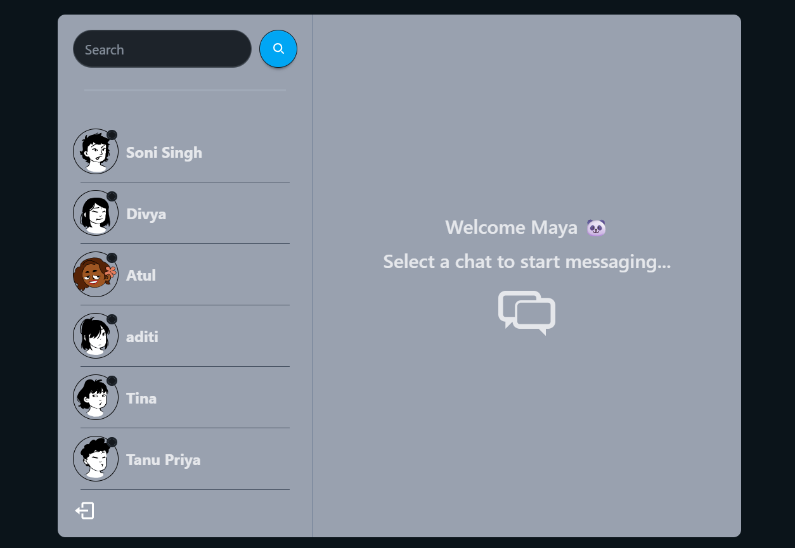
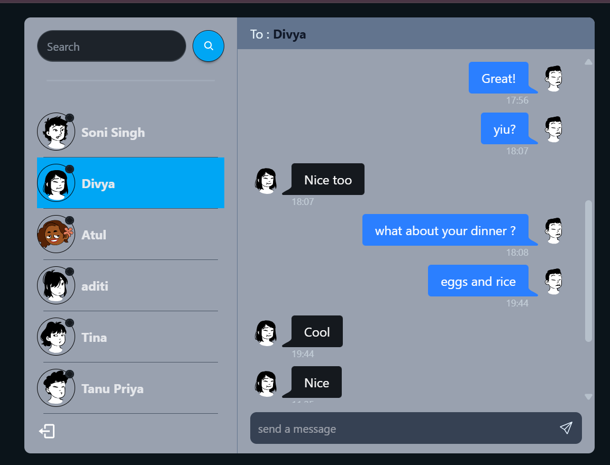

# 💬 MERN Chat App

A full-stack real-time chat application built from scratch using the MERN stack. Users can register, log in securely, see online users in real time, and exchange instant messages powered by Socket.IO.

---

## 🚀 Live Demo

**Live:** https://mern-chat-app-mgo8.onrender.com

**GitHub:** https://github.com/SoniSingh17/MERN-Chat-app.git

---

## ✨ Features

- 🔐 User Authentication using JWT
- 🍪 Secure authentication with HTTP-only cookies
- 🛡️ Protected Routes
- 💬 Real-time one-to-one messaging
- 🟢 Online/Offline user indicator
- ⚡ Instant message delivery using Socket.IO
- 📱 Responsive UI
- 🔍 Search users
- 🚪 Logout functionality
- 📦 Persistent chat history
- ☁️ Deployed on Render

---

## 🖼️ Preview

## SignUp Page




## Login Page



## Home Page



## Chat Screen



---

## 🛠️ Tech Stack

### Frontend

- React.js
- React Router
- Tailwind CSS
- DaisyUI
- Fetch
- Zustand
- Socket.IO Client

### Backend

- Node.js
- Express.js
- MongoDB
- Mongoose
- Socket.IO
- JWT Authentication
- Cookie Parser
- bcryptjs

### Deployment

- Render

---

## 🔐 Authentication

The application uses JWT-based authentication.

- User Signup
- User Login
- Secure JWT generation
- HTTP-only Cookies
- Protected Backend Routes
- Password Hashing using bcrypt

Only authenticated users can access chats.

---

## ⚡ Real-Time Communication

Socket.IO powers the real-time communication layer.

Features include:

- Instant message delivery
- Online user detection
- Automatic offline detection
- Live UI updates without page refresh

When a user closes the browser or loses connection, Socket.IO automatically removes them from the online users list.

---

## 🗄️ Database Design

### User

Stores

- Name
- Username
- Password (hashed)
- Profile Picture
- Gender

---

### Conversation

Stores

- Participants
- Messages exchanged between two users

---

### Message

Stores

- Sender
- Receiver
- Message Content
- Timestamp

---

## 📂 Project Structure

```
backend/
    controllers/
    db/
    middleware/
    models/
    routes/
    socket/
    utils/

frontend/
    src/
        components/
        pages/
        hooks/
        context/
        utils/
```

---

## API Endpoints

### Authentication

| Method | Endpoint |
|---------|-----------|
| POST | /api/auth/signup |
| POST | /api/auth/login |
| POST | /api/auth/logout |

### Users

| Method | Endpoint |
|---------|-----------|
| GET | /api/users |

### Messages

| Method | Endpoint |
|---------|-----------|
| GET | /api/messages/:id |
| POST | /api/messages/send/:id |

---

## Installation

Clone the repository

```bash
git clone https://github.com/SoniSingh17/MERN-Chat-app.git
```

Install dependencies

```bash
npm install
npm install --prefix frontend
```

Run the frontend

```bash
cd frontend
npm run dev
```

Run the backend

```bash
npm run server
```

---

## What I Learned

This project helped me gain hands-on experience with:

- Building REST APIs
- JWT Authentication
- Authorization Middleware
- MongoDB Data Modeling
- Socket.IO
- React State Management
- Protected Routes
- Full-Stack Deployment
- Real-Time Systems

---

## Author

Soni Singh

LinkedIn: https://www.linkedin.com/in/soni-singh1712/

GitHub: https://github.com/SoniSingh17